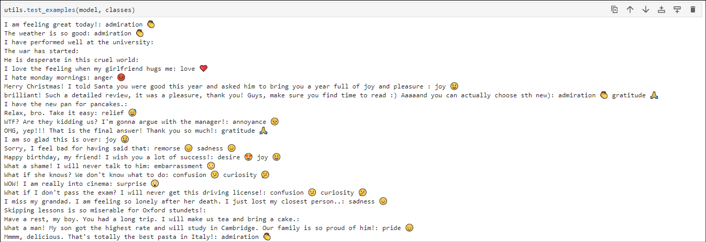

# Sentiment analysis and emotions prediction
---
This repository contains package for solving sentiment prediction problem using
Python and Tensorflow.  

### 💬 Dataset  
GoEmotions dataset was used for modelling and analysis. This is a human annotated
dataset extracted from Reddit comments. Dataset contains 27 emotions + neutral.
[Follow the link to see more.](https://github.com/google-research/google-research/tree/master/goemotions)

### 📈 Modelling  
This repository contains notebooks training classifier `bert_model.py` based on [BERT model](https://github.com/google-research/bert). 
Models solve multiclass, multilabel classification problem. See notebooks
`bert_model_v0.7.1.ipynb` and `bert_model_v0.7.2.ipynb`.

### 🍳 Data preparation  
High-quality data is important for good modelling. In `standardize.py` I created
text standardization layer for tensorflow, performs cleaning of chat/comments-styled
texts in English. This layer is integrated into the model (and can be used in
other models), so that model works directly with raw texts. See below list
of applied reformats:
- fix unicode chars (unidecode lib)
- replace contractions with full words
- fix streched letters in words (e.g. soooooo, youuuuuuuu)
- replace chat language with full phrases (e.g. lol, asap)
- remove placeholders used in GoEmotions dataset (e.g. [NAME], [RELIGION])
- remove words containing numbers
- remove /r tags used in reddit comments (GoEmotions source)
- remove all charactes except for letters, some punctuation and hyphen
- replace duplicated punctuation with a single char
- propper-set punctuation without space before and with 1 space after
- remove multiple spaces and trim
- convert to lowercase

__⚠️ Please note that this layer has a dependency of [unidecode lib](https://pypi.org/project/Unidecode/)__

### 🛠️ Tools
In `utils.py` you can find various handy functions used for modelling and analysis.
You can use notebooks as examples to develop your own models. See `requirements.txt` for list of required libs.   

### ✅ Results
Using `small_bert/bert_en_uncased_L-2_H-128_A-2` classifier reached the following
metrics in emotions prediction:  
`F1-Score (micro): 0.5788`  
`F1-Score (macro): 0.5009`  
and in sentiments prediction:  
`F1-Score (micro): 0.7754`  
`F1-Score (macro): 0.7400`  
  
See examples below
